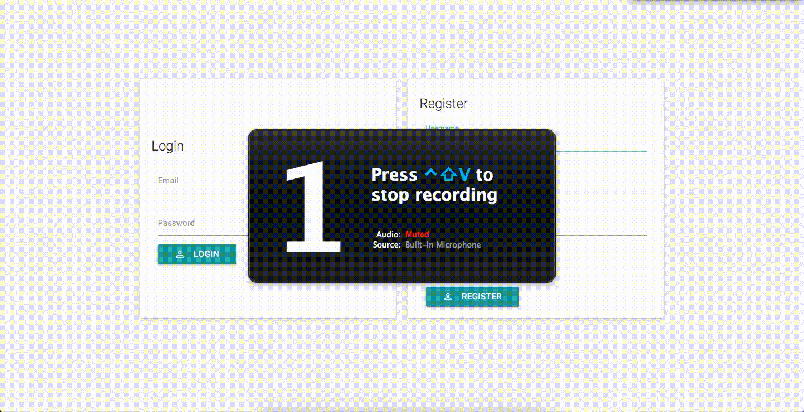

# TodoList
A todo list with memorable URLs.



The application is a very simple todo app designed to let you choose the slug so you can access it easily later. It's built using Laravel and Knockout.js. The design framework is MaterializeCSS.

## Install

```bash
# Clone the repo into your current directory
git clone https://github.com/TheJokersThief/TodoList.git .

# Create some basic folders excluded in the .gitignore for dev reasons
mkdir bootstrap/cache
mkdir storage/framework
mkdir storage/framework/views
mkdir storage/framework/sessions
chmod 777 -R storage

# Install dependencies
composer install

# Install the database migrations
php artisan migrate

# Generate JS + CSS
npm install gulp
npm install laravel-elixir
gulp

```